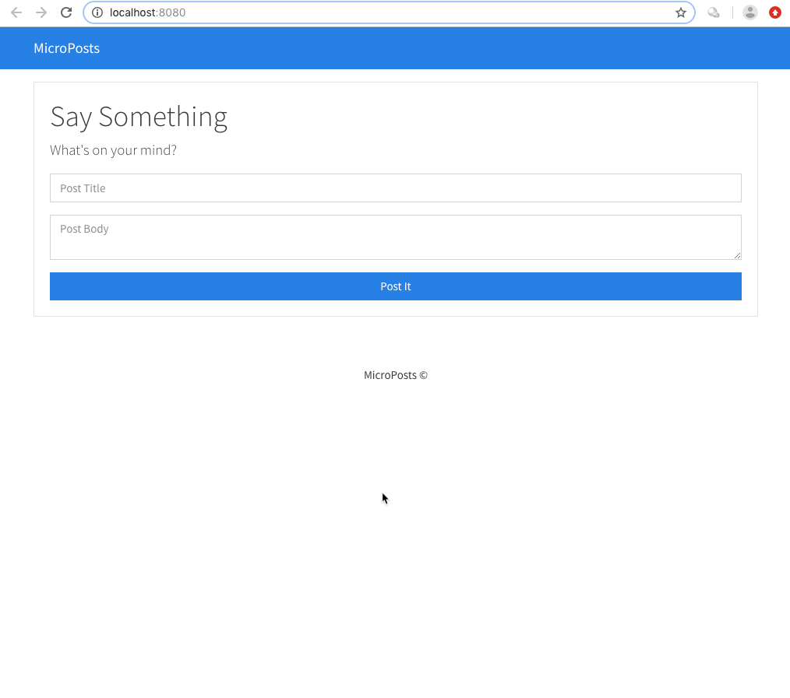
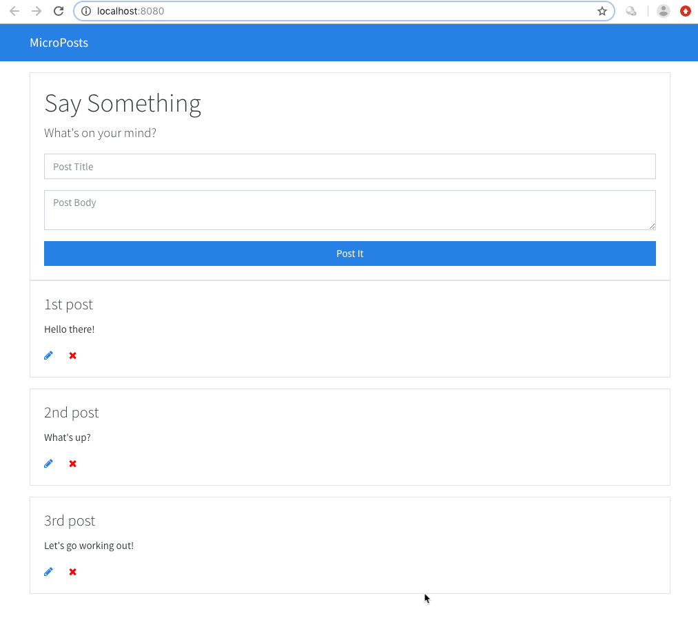

# MicroPosts website - Post what's on your mind

A website where you can post what's on your mind. You post a title and text. Once submitted the posts can be edited or deleted.

It is a full CRUD application built with pure vanilla JavaScript.

It includes the easyHTTP library from the earlier project.
[easyHTTP library](https://github.com/AlbertStjarne/Custom_HTTP_library)

To mimic a REST API JSON Server has been used holding a json file with the added posts.
[JSON Server](https://github.com/typicode/json-server)

Bootstrap with the bootswatch theme has been used for styling.
[bootswatch](https://bootswatch.com)

## Screenshots

Add post

Update and delete post

## Author
* Albert Stjärne (https://github.com/AlbertStjarne)